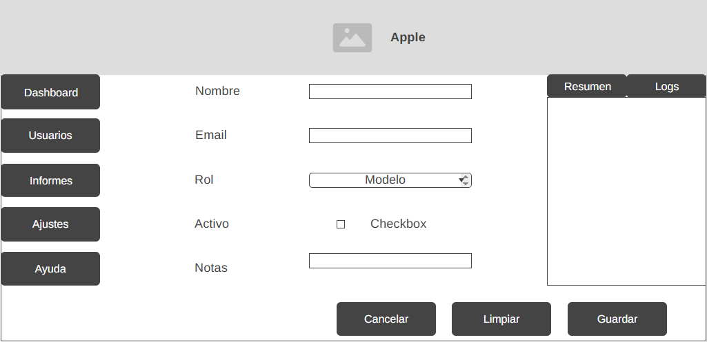
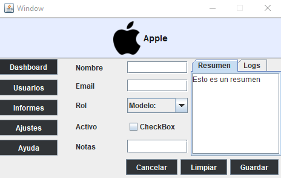
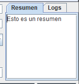
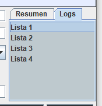

# 🖥️ Tarea Módulo 2: Paneles y Layouts como profesionales

## 📖 Descripción
Este proyecto consiste en diseñar una interfaz gráfica en **Java Swing** siguiendo un **wireframe** y un árbol de contenedores.  
El objetivo es practicar con distintos **layouts** (`BorderLayout`, `FlowLayout`, `GridLayout`, `GridBagLayout`) y la creación de un **JDialog modal** para confirmaciones.

El ejercicio pone en práctica:
- 🎨 Diseño de interfaces basado en wireframes.  
- 🧩 Organización mediante contenedores y layouts.  
- ⚙️ Uso de propiedades clave (insets, weightx/weighty, fill, anchor).  
- 🖼️ Capturas de funcionamiento para validar comportamiento al redimensionar.  

---

## 📌 Objetivo
Diseñar una interfaz siguiendo un **wireframe** y un árbol de contenedores, usando conscientemente:
- 🔲 `JPanel`  
- 📐 `BorderLayout`  
- ➡️ `FlowLayout`  
- 🧱 `GridLayout`  
- 🗂️ `GridBagLayout`  
- 🔔 `JDialog` modal  

Entregar:
- 🖼️ Wireframe dibujado  
- 🌳 Árbol de contenedores  
- 📷 Capturas  
- 📝 Breve explicación (RA1 y RA4)  

---

## 📝 Planificación en papel

### 🖼️ Wireframe
- **Header (NORTH):** título + icono 🏷️  
- **Lateral (WEST):** 5 botones de navegación (Dashboard, Usuarios, Informes, Ajustes, Ayuda)  
- **Centro (CENTER):** Formulario con 2 columnas (Nombre, Email, Rol, Activo, Notas)  
- **Derecha (EAST):** Previsualización con JTabbedPane (Resumen, Logs) 📑  
- **Barra inferior (SOUTH):** botones Cancelar, Limpiar, Guardar alineados a la derecha 💾  

### 🌳 Árbol de contenedores
```
JFrame (BorderLayout)
 ├─ NORTH: headerPanel (FlowLayout)
 ├─ WEST: navPanel (GridLayout 5x1)
 ├─ CENTER: formPanel (GridBagLayout)
 ├─ EAST: previewPanel (BorderLayout) → JTabbedPane
 └─ SOUTH: buttonBar (FlowLayout RIGHT)
```

### 🔑 Componentes clave
- Fuentes 🅰️  
- Tooltips ℹ️  
- Gaps ↔️  
- Insets ↕️  
- weightx/weighty ⚖️  
- fill y anchor 🎯  

---

## 🛠️ Construcción en IntelliJ GUI Designer

### 1️⃣ Crear formulario y root panel
- New → GUI Form → GestorUsuarios
- Root panel → Right click → Set Layout → BorderLayout

### 2️⃣ Header (NORTH)
- JPanel → NORTH
- Layout: FlowLayout
- JLabel (icono + título) → text="Gestor de usuarios", font=Bold 18, icon opcional
- (Opcional) JSeparator debajo

### 3️⃣ Navegación (WEST)
- JPanel → WEST
- Layout: GridLayout 5x1, vgap=5
- 5 JButton: Dashboard, Usuarios, Informes, Ajustes, Ayuda
- Propiedad: Same Size Horizontally

### 4️⃣ Formulario (CENTER) – GridBagLayout
- JPanel → CENTER
- Layout: GridBagLayout
- Fila 0: JLabel "Nombre" + JTextField (weightx=1, fill=HORIZONTAL, insets=5)
- Fila 1: JLabel "Email" + JTextField
- Fila 2: JLabel "Rol" + JComboBox (Admin, Editor, Invitado)
- Fila 3: JLabel "Activo" + JCheckBox
- Fila 4: JLabel "Notas" + JScrollPane con JTextArea (weighty=1, fill=BOTH)
- Alineación de etiquetas: anchor=WEST

### 5️⃣ Previsualización (EAST)
- JPanel → EAST → BorderLayout
- JTabbedPane → CENTER
  - Pestaña 1: "Resumen" → JTextArea readOnly dentro de JScrollPane
  - Pestaña 2: "Logs" → JTextArea o JList
- Preferred size ≈ 260px ancho

### 6️⃣ Botonera (SOUTH)
- JPanel → SOUTH → FlowLayout RIGHT
- JButton: Cancelar, Limpiar, Guardar
- Same Size Horizontally
- Default Button: Guardar (opcional)

---

## 🔔 Diálogo modal de confirmación (JDialog)
- GUI Form → DialogConfirmacion
- JLabel: "¿Guardar cambios?"
- JButton: Aceptar, Cancelar
- Mostrar al pulsar Guardar:
```java
dialog.setModal(true);
dialog.pack();
dialog.setVisible(true);
```

---

## ⚙️ Ajustes de comportamiento
- GridLayoutManager: Size Policy = Can grow, usar weightx/weighty en GridBagLayout
- FlowLayout: respetar tamaño preferido
- BorderLayout: CENTER crece, EAST/WEST conservan preferred width
- Para mover componentes: Ctrl+X → panel destino → Ctrl+V

---

## 📂 Estructura del proyecto

Estructura del proyecto:

```
PanelsAndLayouts/
├── .idea/                      # Configuración del proyecto en IntelliJ
├── capturas/                   # Capturas de pantalla para el README
├── src/
│   ├── main/
│   │   ├── java/
│   │   │   └── org/example/
│   │   │       ├── DialogConfirmacion.java
│   │   │       ├── DialogConfirmacion.form
│   │   │       ├── Window.java
│   │   │       └── Window.form
│   │   └── resources/
│   │       └── image/
│   │           ├── apple.png
│   │           └── apple - copia.png
│   └── test/
│       └── java/
│           └── org/example/
│               └── AppTest.java
├── .gitignore
├── pom.xml                     # Configuración de Maven
└── README.md                   # Documentación del proyecto
```

---

## 📊 Tabla de propiedades clave

| Zona              | Layout        | Propiedades principales                          |
|-------------------|--------------|------------------------------------------------|
| Header (NORTH)    | FlowLayout   | font=Bold 18, alignment=CENTER, icon opcional   |
| Navegación (WEST) | GridLayout   | rows=5, cols=1, vgap=5, Same Size Horizontally  |
| Formulario (CENTER)| GridBagLayout | insets=5,5,5,5; weightx=1 en campos; weighty=1 en notas; anchor=WEST; fill=HORIZONTAL/BOTH |
| Previsualización (EAST)| BorderLayout | Preferred size=260px, JTabbedPane con pestañas |
| Botonera (SOUTH)  | FlowLayout   | alignment=RIGHT, Same Size Horizontally, Default Button=Guardar |

---

## 🎞 Capturas y explicación

### 🔹 Wireframe inicial


Un **wireframe** es un boceto visual o esquema básico que representa la estructura de una interfaz de usuario.  
Sirve como guía inicial para planificar dónde se ubicarán los elementos y cómo será la distribución.  
Esto permite validar ideas antes de invertir en diseño detallado o código.

### 📷 Captura general


Se ha añadido el siguiente código para evitar que la ventana se amplíe:
```java
frame.setResizable(false); // Evita que la ventana sea redimensionable
```

### 🗂️ JTabbedPane


Aquí podemos ver la primera pestaña del JTabbedPane, que engloba un textArea.

### 🗂️ JTabbedPane 2


Aquí podemos ver la segunda pestaña del JTabbedPane, que contiene un JList.

### 🔔 Dialog


Aquí podemos ver el Dialog que se abre al pulsar el botón guardar.  
El siguiente código es necesario para abrirlo:

```java
public Window() {
    guardarButton.addActionListener(e -> {
        DialogConfirmacion dialog = new DialogConfirmacion();
        dialog.setModal(true);
        dialog.pack();
        dialog.setLocationRelativeTo(null);
        dialog.setVisible(true);
    });
}
```

---

## 📌 Chuleta rápida IntelliJ GUI Designer
- ⚙️ Cambiar layout: Right click panel → Set Layout  
- ✂️ Mover componente: Ctrl+X → panel destino → Ctrl+V  
- 📏 Igualar tamaños: Same Size Horizontally/Vertically  
- ↔️ Márgenes: insets (GridBag) o border/margin del panel  
- 📐 Espaciados: hgap, vgap (Flow/Grid)  
- ⬆️⬇️ Hacer crecer campos: GridBag → weightx=1, fill=HORIZONTAL/BOTH  
